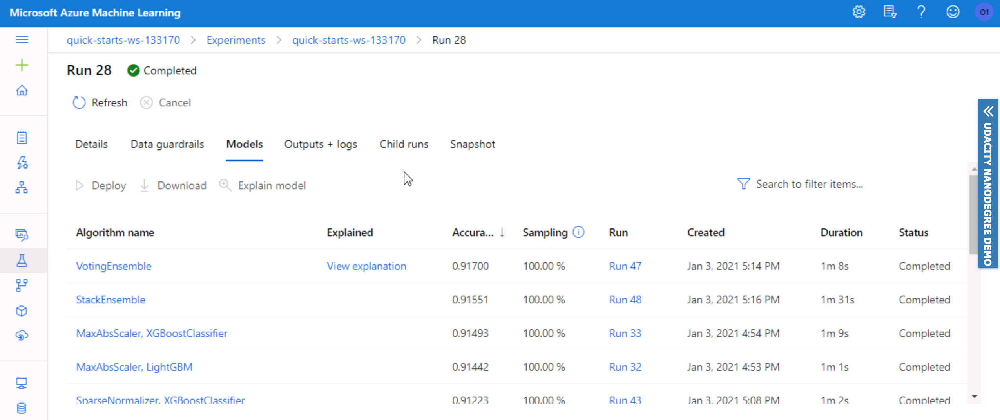
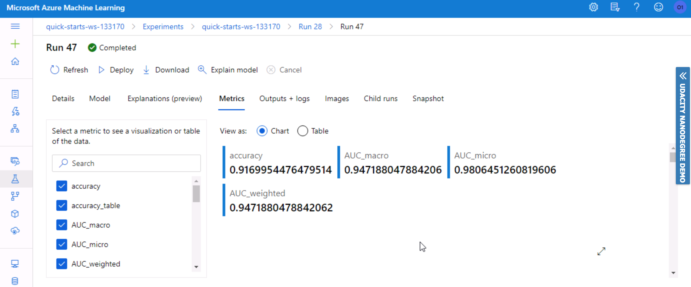
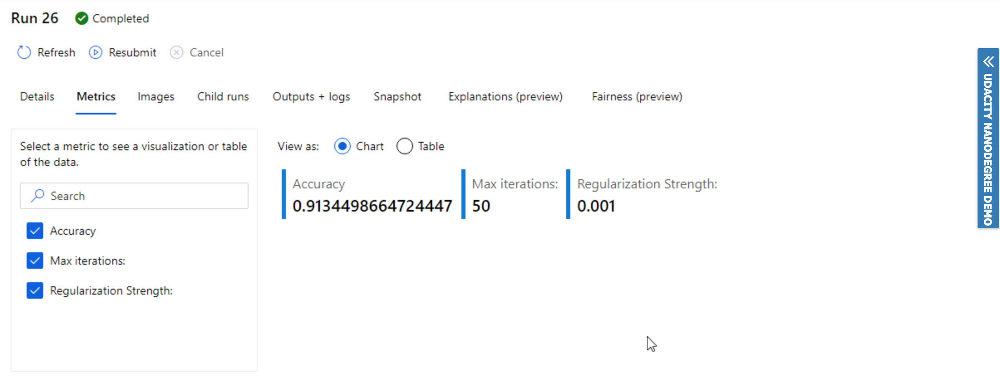
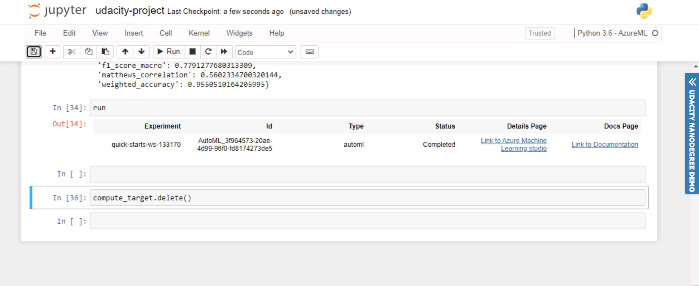

# Optimizing an ML Pipeline in Azure

## Table of content
* [Overview](#overview)
* [Summary](#summary)
* [Scikit-learn Pipeline](#scikit-learn-pipeline)
* [AutoML](#automl)
* [Pipeline comparison](#pipeline-comparison)
* [Future work](#future-work)
* [Proof of cluster clean up](#proof-of-cluster-clean-up)
* [References](#references)

## Overview
This project is part of the Udacity Azure ML Nanodegree.
In this project, we build and optimize an Azure ML pipeline using the Python SDK and a provided Scikit-learn model.
This model is then compared to an Azure AutoML run.

## Summary
This dataset shows information about the marketing campaign of a bank,  The aim of the analysis is to predict potential customers who are willing to contribute to the bank's future loan or deposit plans. Hence, improving the overall future performance. 
The dataset contains 11162 records with 17 columns.

The best performing model was a VotingEnsemble pipeline using AutoML with 0.917 accuracy rate. 

## Scikit-learn Pipeline
After retrieving the dataset from the provided URL using TabularDataFactory class. The followed steps have been applied to for Scikit-learn Pipeline:
- Dataset has been cleared and preprocessed using clean_data method in train.py script. The preprocessing involved dropping nulls values, encoding categorical features using a one-hot numeric approach, and more. 
- Then splitting the data into training and testing set using train_test_split class.
- LogisticRegression class has been used to fit the model. 
- Defining the estimator then passed it to HyperDriveConfig script.
- Parameter sampler 'RandomParameterSampling' holds the tuning hyperparameters (--C: Inverse of regularization, --max_iter: Maximum number of iterations) to be passed to the HyperDriveConfig script. 
- Early termination policy has been added to the script then experiment submission. 

The best model of the pipeline was recorded with the following result: accuracy = 0.913, C=0.001, and max_iter=50.

**Parameter Sampler**

Discrete values with 'choice' have been used for both tuned parameters. RandomParameterSampling has been selected due to its fast performance, simple approach, and would provide random unbiased search in the overall population. In addition, it gives satisfactory results and supports the early termination policy of low-performance runs which result in saving resources. Grid Sampling can be used for exhaustive search over the search space if the budget was not an issue. 

**Termination policy**

BanditPolicy has been used with the parameters evaluation_interval=2 and slack_factor=0.1 as an early stopping policy to improve the performance of the computational resources by automatically terminating poorly and delayed performing runs. Bandit Policy ends runs if the primary metric is not within the specified slack factor/amount when compared with the highest performing run.

Azure ML also supports Median stopping,  and Truncation selection early termination policies. Median stopping terminats runs based on the running averages of primary metrics. Thus, computing all training runs averages and eliminate the worse runs. Truncation selection terminats a percentage of the lowest performing runs. Both methods require more computations and evaluations compared with bandit policy.  

## AutoML
Used hyperparameters for AutoML:

```automl_config = AutoMLConfig(
    experiment_timeout_minutes=20,
    task='classification',
    primary_metric='accuracy',
    training_data=ds,
    compute_target=compute_target,
    label_column_name='y',
    n_cross_validations=5) 
```
- experiment_timeout_minutes has been reduced to 20 minutes to avoid the run time out failure. 
- Experiment type set to 'classification'.
- Accuracy has been selected as a primary metric.
- 5 folds have been selected for cross-validation parameter. 



The AutoML pipeline started by cleaning the data such as normalizing continuous numeric features. Then, applying multiple algorithms for example GradientBoosting, TensorFlowLinearClassifier, VotingEnsemble, XGBoostClassifier , LogisticRegression...etc. The best model resulted from VotingEnsemble algorithm with 0.917 accuracy rate. VotingEnsemble takes a majority vote of several algorithms which makes it surpass individual algorithms and minimize the bias.

Parameters generated by AutoML Voting ensemble includes:

- n_jobs=1 > calculation takes 100% of one cores in the cpu.
- n_estimators=25 > number of generated trees is 25.
- oob_score=True > Out-of-bag error calculates the accuracy of the omitted training trees  used in the random forest ensemble. 
- min_weight_fraction_leaf=0.0 > The sum of minimum weighted fraction of all samples at a leaf node default value is 1.
- verbose=0 > training progress will show nothing (silent).
```
PipelineWithYTransformations(Pipeline={'memory': None,
                                        'steps': [('datatransformer',
                                                   DataTransformer(enable_dnn=None,
                                                                   enable_feature_sweeping=None,
                                                                   feature_sweeping_config=None,
                                                                   feature_sweeping_timeout=None,
                                                                   featurization_config=None,
                                                                   force_text_dnn=None,
                                                                   is_cross_validation=None,
                                                                   is_onnx_compatible=None,
                                                                   logger=None,
                                                                   observer=None,
                                                                   task=None,
                                                                   working_dir=None))...
                                                                   min_weight_fraction_leaf=0.0,
                                                                   n_estimators=25,
                                                                   n_jobs=1,
                                                                   oob_score=True,
                                                                   random_state=None,
                                                                   verbose=0,
                                                                   arm_start=False))],
                                                                   verbose=False))],
                                                                   flatten_transform=None,
                                                                                 weights=[0.26666666666666666,
                                                                                          0.13333333333333333,
                                                                                          0.06666666666666667,
                                                                                          0.13333333333333333,
                                                                                          0.13333333333333333,
                                                                                          0.06666666666666667,
                                                                                          0.2]))],
                                        'verbose': False},
                              y_transformer={},
                              y_transformer_name='LabelEncoder'))
```


The best model (VotingEnsemble): 


The best model metrics:

```
{'experiment_status': ['DatasetEvaluation',
  'FeaturesGeneration',
  'DatasetFeaturization',
  'DatasetFeaturizationCompleted',
  'DatasetBalancing',
  'DatasetCrossValidationSplit',
  'ModelSelection'],
 'experiment_status_description': ['Gathering dataset statistics.',
  'Generating features for the dataset.',
  'Beginning to fit featurizers and featurize the dataset.',
  'Completed fit featurizers and featurizing the dataset.',
  'Performing class balancing sweeping',
  'Generating individually featurized CV splits.',
  'Beginning model selection.'],
 'average_precision_score_weighted': 0.9559031211267512,
 'AUC_macro': 0.947188047884206,
 'precision_score_macro': 0.7975368448525979,
 'norm_macro_recall': 0.5275693725363924,
 'balanced_accuracy': 0.7637846862681963,
 'average_precision_score_macro': 0.8272763253506387,
 'precision_score_micro': 0.9169954476479514,
 'AUC_weighted': 0.9471880478842062,
 'log_loss': 0.2243431819636159,
 'recall_score_macro': 0.7637846862681963,
 'average_precision_score_micro': 0.9813850930809564,
 'f1_score_weighted': 0.9145324016271321,
 'AUC_micro': 0.9806451260819606,
 'f1_score_micro': 0.9169954476479514,
 'recall_score_micro': 0.9169954476479514,
 'accuracy': 0.9169954476479514,
 'recall_score_weighted': 0.9169954476479514,
 'precision_score_weighted': 0.9128572527634494,
 'f1_score_macro': 0.7791277680313309,
 'matthews_correlation': 0.5602334700320144,
 'weighted_accuracy': 0.9550510164205995}
```
## Pipeline comparison
**Compare the two models and their performance. What are the differences in accuracy? In architecture? If there was a difference, why do you think there was one?**

The difference in accuracy between both models is slightly better in the AutoML pipeline compared with the HyperDrive(SKLearn) model with a variance of 0.003. However, even with this small variance, AutoML is better since the pipeline automatically performs the necessary calculations, validations, training, using different algorithms...and more. This makes it exceed the SKLearn experience where we need to explicitly specify the adjustment and spend more time to get the best hyperparameters combinations. 




## Future work
**What are some areas of improvement for future experiments? Why might these improvements help the model?**

Resolving the imbalance issue in the dataset, this type of issue is common in the Classification problems by resampling either by (Over or Undersampling) or ensemble of Sampler using BaggingClassifier classifier for example this will improve the model accuracy. In addition, trying Median stopping,  and Truncation selection early termination policies to explore this concept more. I would also try to use F1 score as a performance matrics instead of accuracy since we are trying to predict whether customers would contribute to the future bank plans where we care more about the positive class. 

## Proof of cluster clean up


## References

- Udacity Nanodegree content.
- https://docs.microsoft.com/en-us/azure/machine-learning/how-to-tune-hyperparameters
- https://towardsdatascience.com/having-an-imbalanced-dataset-here-is-how-you-can-solve-it-1640568947eb
- https://scikit-learn.org/stable/modules/generated/sklearn.preprocessing.OneHotEncoder.html
- https://github.com/MicrosoftDocs/azure-docs/blob/master/articles/machine-learning/how-to-tune-hyperparameters.md
- https://k21academy.com/microsoft-azure/dp-100/hyperparameter-tuning-in-azure/
- https://www.analyticsvidhya.com/blog/2019/08/11-important-model-evaluation-error-metrics/
- https://neptune.ai/blog/f1-score-accuracy-roc-auc-pr-auc#2
